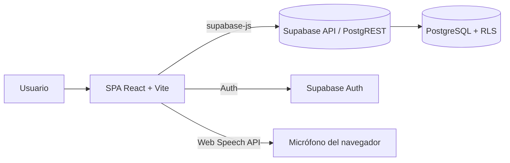
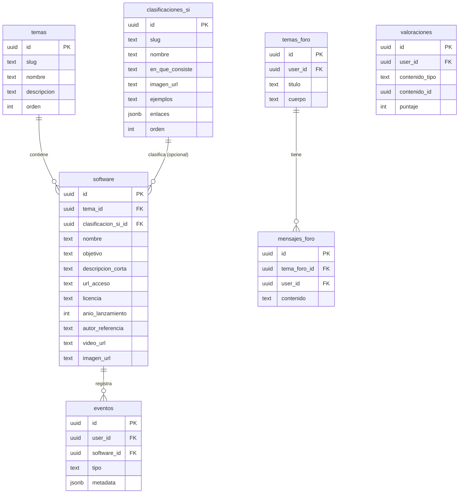
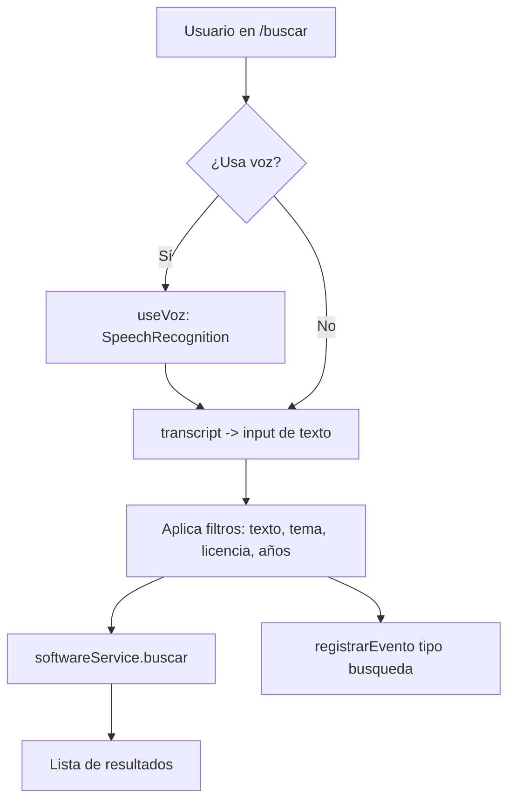

# PRD — Catálogo de Software de IA (`ia-dex`)

Materia: Sistemas Inteligentes · Trabajo práctico integrador
Equipo: Avila Poletti · Cano Alejandro · Gomez Fabricio
Revisión con cátedra: viernes 12 · Entrega final: martes 16
Versión del documento: 1.0

---

## 1. Resumen

Aplicación web que funciona como catálogo navegable de software de inteligencia artificial, organizado por los temas del curso, más una sección educativa de clasificaciones de sistemas inteligentes. Permite buscar por múltiples campos (incluida búsqueda por voz), puntuar contenidos, participar de un foro y consultar estadísticas y recomendaciones.

El documento es la fuente de referencia funcional y técnica del proyecto. La verdad operativa de datos es el esquema de la base (ver sección 9): cualquier discrepancia entre este PRD y el esquema se resuelve a favor del esquema.

---

## 2. Objetivos y mapeo a la rúbrica

| # | Requerimiento de la consigna | Puntos | Dónde se cubre |
|---|---|---|---|
| 1 | App que expone ≥50% del contenido + catálogo de software (nombre, objetivo, enlace, licencia, año, autor/referencia) | 3 | §13.1 Catálogo |
| 2 | Descripción corta del software + video/material demostrativo | 1 | §13.1 Ficha de software |
| 3 | Búsqueda por diferentes campos en diferentes secciones | 1 | §13.2 Búsqueda |
| 4 | Recursos para búsqueda por voz (lenguaje natural) y lengua de señas; implementar de ser posible | 2 | §14 Búsqueda por voz e investigación de señas |
| 5 | Clasificaciones de SI (imágenes, en qué consisten, ejemplos, enlaces) + puntuación + foro + estadísticas y recomendaciones | 2 | §13.3–13.6 |
| 6 | Exposición en clase en tiempo y forma | 1 | §16 Plan (Fase K) |

Cobertura de contenido (requisito del ítem 1): el catálogo cubre 7 de ~12 bloques temáticos del curso (~58%). Los 7 temas figuran en §9.1.

---

## 3. Alcance

Incluye:

- Catálogo de software por tema, con ficha completa y multimedia.
- Sección educativa de clasificaciones de sistemas inteligentes.
- Búsqueda multicampo por texto, tema, licencia y rango de años, con entrada por voz.
- Autenticación de usuarios (email + contraseña).
- Valoraciones (1–5) sobre software, temas y clasificaciones.
- Foro de debate con temas y respuestas.
- Estadísticas (software más visto y mejor valorado) y recomendaciones, en el ingreso y durante la navegación.
- Despliegue público.

Fuera de alcance:

- Implementación funcional de reconocimiento de lengua de señas (solo investigación documentada; ver §14.2).
- Roles administrativos en la app (la carga de catálogo se hace desde el panel de Supabase).
- Notificaciones, mensajería privada, edición de mensajes del foro.

---

## 4. Stack y arquitectura

| Capa | Tecnología | Notas |
|---|---|---|
| Frontend | Vite + React 19 + TypeScript | SPA |
| Estilos | Tailwind CSS v4 (plugin `@tailwindcss/vite`) | Sin `tailwind.config.js`; tema vía `@theme` en CSS |
| Routing | `react-router-dom` v6+ | Rutas en §7.4 |
| Acceso a datos | `@supabase/supabase-js` v2 | Query builder, no ORM |
| Backend | Supabase (PostgreSQL 15+, Auth, Realtime, Storage) | RLS activado |
| Búsqueda por voz | Web Speech API (`SpeechRecognition`) | Nativa del navegador |
| Despliegue | Vercel (frontend) + Supabase (backend) | Recomendado |



Decisiones de arquitectura ya tomadas:

- Sin backend propio: el front habla directo con Supabase. La seguridad la garantiza el RLS, no la capa de servidor.
- Temas y clasificaciones de SI son dos ejes separados (modelo en §9).
- Valoraciones polimórficas: una sola tabla sirve para puntuar software, temas y clasificaciones.
- Sin ORM: se usa `supabase-js`; el type-safety se obtiene de los tipos generados desde el esquema.

---

## 5. SSOT (Single Source of Truth)

| Qué | Fuente única | Deriva |
|---|---|---|
| Modelo de datos | `01_esquema_supabase.sql` ejecutado en Supabase | Toda la estructura de tablas, relaciones y reglas |
| Tipos del dominio | El esquema → `src/types/database.types.ts` (generado con `npx supabase gen types typescript`) | Los DTOs y firmas de servicios (§10–11) |
| Reglas de acceso | Políticas RLS en la base | Comportamiento de lectura/escritura del front |
| Configuración/secretos | `.env.local` (no versionado) + `.env.example` (versionado) | Conexión a Supabase |

Regla: los tipos TypeScript no se escriben "a mano" como fuente; se regeneran desde la base cada vez que cambia el esquema. Los DTOs de §10 documentan el contrato esperado, pero la firma real proviene de los tipos generados.

---

## 6. Convenciones y estándares

Aplican a todo el sistema, sin excepción.

Base de datos (PostgreSQL):
- `snake_case` para tablas y columnas. Tablas en plural y en español (`temas`, `valoraciones`).
- Vistas con prefijo `v_`. Índices con prefijo `idx_`. Políticas con nombre descriptivo en español.
- Claves primarias `uuid` con `gen_random_uuid()`. Marca temporal `created_at timestamptz default now()`.

TypeScript:
- Tipos e interfaces en `PascalCase` (`Software`, `ClasificacionSI`).
- Propiedades de los DTOs en `snake_case`, espejando la base (sin capa de mapeo, para mantener la SSOT directa).
- Variables y funciones en `camelCase`. Constantes en `UPPER_SNAKE_CASE`.
- Booleanos con prefijo `is` / `has` / `can`.
- Sin `any`: usar `unknown` y estrechar el tipo.

React:
- Componentes en `PascalCase`, un componente por archivo (`SoftwareCard.tsx`).
- Hooks con prefijo `use` (`useSoftware.ts`).
- Componentes funcionales con Hooks (no clases).

Archivos y carpetas:
- Componentes: `PascalCase.tsx`. Hooks, servicios y utilidades: `camelCase.ts`.
- Carpetas en minúscula; kebab-case si son compuestas.

Rutas (URL): kebab-case en español. Ver §7.4.

Variables de entorno: prefijo `VITE_` (requisito de Vite para exponerlas al cliente).

Git:
- Conventional Commits: `feat:`, `fix:`, `docs:`, `refactor:`, `chore:`, `style:`.
- Ramas: `feat/nombre`, `fix/nombre`. Integración por Pull Request.

Estilos: utilidades de Tailwind en el markup. Tokens de diseño (colores, fuentes) en `@theme` dentro de `src/index.css`. Evitar CSS suelto salvo casos puntuales.

---

## 7. Estructura del proyecto

### 7.1 Carpetas

```
ia-dex/
  public/
  src/
    assets/
    components/
      layout/          AppLayout.tsx, Sidebar.tsx, Topbar.tsx
      ui/              Button.tsx, Input.tsx, StarRating.tsx, ...
      software/        SoftwareCard.tsx, SoftwareList.tsx
      foro/            TemaForoItem.tsx, MensajeItem.tsx
    pages/             una por ruta (§7.4)
    hooks/             useAuth.ts, useSoftware.ts, useBusqueda.ts, useVoz.ts
    services/          capa de acceso a datos (§11)
    context/           AuthContext.tsx
    types/             database.types.ts (generado), dtos.ts
    lib/               supabase.ts
    routes/            AppRouter.tsx
    App.tsx
    main.tsx
    index.css
  .env.local           (no versionado)
  .env.example
  vite.config.ts
  tsconfig.json
  package.json
```

### 7.2 Capas y responsabilidades

- `lib/`: clientes e infraestructura (cliente de Supabase).
- `services/`: única capa que habla con Supabase. Devuelve DTOs. No contiene JSX ni estado de React.
- `hooks/`: orquestan servicios + estado de React (carga, error, datos). Los componentes solo usan hooks.
- `components/` y `pages/`: presentación. No llaman a `supabase` directamente.

Regla de dependencia: `pages` → `hooks` → `services` → `lib/supabase`. Nunca al revés, nunca salteando capas.

### 7.4 Rutas

| Ruta | Página | Descripción |
|---|---|---|
| `/` | `InicioPage` | Dashboard: estadísticas y recomendaciones |
| `/catalogo` | `CatalogoPage` | Temas (eje 1) |
| `/catalogo/:temaSlug` | `TemaPage` | Software de un tema |
| `/software/:id` | `SoftwareDetallePage` | Ficha completa + valoración |
| `/clasificaciones` | `ClasificacionesPage` | Clasificaciones de SI (eje 2) |
| `/clasificaciones/:slug` | `ClasificacionDetallePage` | Detalle educativo + valoración |
| `/buscar` | `BuscarPage` | Búsqueda multicampo + voz |
| `/foro` | `ForoPage` | Lista de temas del foro |
| `/foro/:id` | `ForoTemaPage` | Tema + respuestas |
| `/estadisticas` | `EstadisticasPage` | Estadísticas detalladas |
| `/login` | `LoginPage` | Registro / inicio de sesión |

---

## 8. Roles y autenticación

- Visitante (sin sesión): navega catálogo, clasificaciones, búsqueda, foro (lectura) y estadísticas.
- Usuario autenticado: además puede valorar, crear temas y responder en el foro.

Autenticación con Supabase Auth (email + contraseña). El RLS exige sesión para escribir en `valoraciones`, `temas_foro` y `mensajes_foro` (`auth.uid() = user_id`).

---

## 9. Modelo de datos

Fuente: `01_esquema_supabase.sql` (SSOT). Resumen:



Notas:
- `valoraciones` no tiene FK a `contenido_id` porque es polimórfica; la integridad la dan `contenido_tipo` (CHECK) y el `unique(user_id, contenido_tipo, contenido_id)`.
- `software.clasificacion_si_id` es opcional (el cruce entre ejes).
- Vistas: `v_software_rating` (promedio y cantidad de votos) y `v_software_populares` (cantidad de vistas), ambas con `security_invoker = on`.

### 9.1 Datos de catálogo (a cargar)

Temas (eje 1, 7 bloques ≈ 58%):

1. Búsqueda y resolución de problemas / juegos
2. Representación del conocimiento y razonamiento
3. Aprendizaje automático
4. Reconocimiento de patrones / visión
5. Algoritmos genéticos y búsqueda local
6. Bots y procesamiento del lenguaje natural
7. Interacción Hombre-Máquina

Clasificaciones de SI (eje 2) — extraídas del material de cátedra:

Por paradigma (apuntes de Introducción y Representación del conocimiento):
- IA Simbólica — el conocimiento se representa con unidades discretas (reglas, fórmulas, relaciones).
- IA Sub-simbólica (no simbólica) — el conocimiento se transmite por propiedades implícitas de los objetos.

Por enfoque / Modelos de IA de Russell & Norvig (apunte Unidades 1, 2 y 3):
- Sistemas que piensan como humanos
- Sistemas que actúan como humanos
- Sistemas que piensan racionalmente
- Sistemas que actúan racionalmente

Técnicas de sistemas inteligentes definidas en el material (apunte Unidades; "técnicas inspiradas en biología" en Introducción):
- Sistemas Expertos
- Redes Neuronales
- Algoritmos Genéticos

> Nota: "lógica difusa" y "agentes" no figuran como clasificación propia en el material relevado; no se incluyen salvo confirmación.

---

## 10. DTOs / tipos del dominio

Definidos en `src/types/dtos.ts`. Propiedades en `snake_case` para espejar la base.

```ts
export type ContenidoTipo = 'software' | 'tema' | 'clasificacion_si'
export type EventoTipo = 'vista' | 'busqueda' | 'click_enlace'

export interface Enlace { titulo: string; url: string }

export interface Tema {
  id: string
  slug: string
  nombre: string
  descripcion: string | null
  orden: number
  created_at: string
}

export interface ClasificacionSI {
  id: string
  slug: string
  nombre: string
  en_que_consiste: string | null
  imagen_url: string | null
  ejemplos: string | null
  enlaces: Enlace[]
  orden: number
  created_at: string
}

export interface Software {
  id: string
  tema_id: string
  clasificacion_si_id: string | null
  nombre: string
  objetivo: string | null
  descripcion_corta: string | null
  url_acceso: string | null
  licencia: string | null
  anio_lanzamiento: number | null
  autor_referencia: string | null
  video_url: string | null
  imagen_url: string | null
  created_at: string
}

export interface Valoracion {
  id: string
  user_id: string
  contenido_tipo: ContenidoTipo
  contenido_id: string
  puntaje: number
  created_at: string
}

export interface TemaForo {
  id: string
  user_id: string
  titulo: string
  cuerpo: string | null
  created_at: string
}

export interface MensajeForo {
  id: string
  tema_foro_id: string
  user_id: string
  contenido: string
  created_at: string
}

export interface Evento {
  id: string
  user_id: string | null
  software_id: string | null
  tipo: EventoTipo
  metadata: Record<string, unknown>
  created_at: string
}

// --- DTOs de entrada ---
export interface FiltrosBusqueda {
  texto?: string
  tema_id?: string
  licencia?: string
  anio_desde?: number
  anio_hasta?: number
}
export interface NuevaValoracion {
  contenido_tipo: ContenidoTipo
  contenido_id: string
  puntaje: number
}
export interface NuevoTemaForo { titulo: string; cuerpo?: string }
export interface NuevoMensaje { tema_foro_id: string; contenido: string }
export interface NuevoEvento {
  software_id?: string
  tipo: EventoTipo
  metadata?: Record<string, unknown>
}

// --- DTOs de salida (vistas / agregados) ---
export interface SoftwareRating {
  software_id: string
  nombre: string
  promedio: number
  cantidad_votos: number
}
export interface SoftwarePopular {
  software_id: string
  nombre: string
  vistas: number
}
```

---

## 11. Contratos de la capa de servicios

Cada servicio devuelve DTOs y lanza `error` ante fallo (los hooks lo capturan). Firmas:

```ts
// services/temasService.ts
listarTemas(): Promise<Tema[]>
obtenerTema(slug: string): Promise<Tema | null>

// services/softwareService.ts
listarPorTema(temaId: string): Promise<Software[]>
obtenerSoftware(id: string): Promise<Software | null>
buscar(filtros: FiltrosBusqueda): Promise<Software[]>

// services/clasificacionesService.ts
listarClasificaciones(): Promise<ClasificacionSI[]>
obtenerClasificacion(slug: string): Promise<ClasificacionSI | null>

// services/valoracionesService.ts
miValoracion(tipo: ContenidoTipo, contenidoId: string): Promise<Valoracion | null>
guardarValoracion(input: NuevaValoracion): Promise<Valoracion>   // upsert
promedio(tipo: ContenidoTipo, contenidoId: string): Promise<{ promedio: number; cantidad: number }>

// services/foroService.ts
listarTemasForo(): Promise<TemaForo[]>
obtenerTemaForo(id: string): Promise<TemaForo | null>
listarMensajes(temaForoId: string): Promise<MensajeForo[]>
crearTemaForo(input: NuevoTemaForo): Promise<TemaForo>
crearMensaje(input: NuevoMensaje): Promise<MensajeForo>

// services/eventosService.ts
registrarEvento(input: NuevoEvento): Promise<void>

// services/estadisticasService.ts
softwarePopulares(limite?: number): Promise<SoftwarePopular[]>
mejorValorados(limite?: number): Promise<SoftwareRating[]>
recomendaciones(temaId?: string, limite?: number): Promise<Software[]>
```

Implementaciones de referencia (las clave):

```ts
// buscar(): búsqueda multicampo (ítem 3)
async function buscar(filtros: FiltrosBusqueda): Promise<Software[]> {
  let q = supabase.from('software').select('*')
  if (filtros.texto) q = q.or(`nombre.ilike.%${filtros.texto}%,objetivo.ilike.%${filtros.texto}%`)
  if (filtros.tema_id) q = q.eq('tema_id', filtros.tema_id)
  if (filtros.licencia) q = q.eq('licencia', filtros.licencia)
  if (filtros.anio_desde) q = q.gte('anio_lanzamiento', filtros.anio_desde)
  if (filtros.anio_hasta) q = q.lte('anio_lanzamiento', filtros.anio_hasta)
  const { data, error } = await q.order('nombre')
  if (error) throw error
  return data ?? []
}

// guardarValoracion(): un voto por usuario por contenido (ítem 5)
async function guardarValoracion(input: NuevaValoracion): Promise<Valoracion> {
  const { data: { user } } = await supabase.auth.getUser()
  if (!user) throw new Error('Requiere sesión')
  const { data, error } = await supabase
    .from('valoraciones')
    .upsert({ ...input, user_id: user.id }, { onConflict: 'user_id,contenido_tipo,contenido_id' })
    .select()
    .single()
  if (error) throw error
  return data
}

// registrarEvento(): base de estadísticas (ítem 5)
async function registrarEvento(input: NuevoEvento): Promise<void> {
  const { data: { user } } = await supabase.auth.getUser()
  const { error } = await supabase.from('eventos').insert({ ...input, user_id: user?.id ?? null })
  if (error) throw error
}
```

---

## 12. Flujos de usuario

### 12.1 Autenticación
1. El usuario abre `/login` y elige Registrarse o Iniciar sesión.
2. El front llama `supabase.auth.signUp` / `signInWithPassword`.
3. `AuthContext` escucha `onAuthStateChange` y expone `user` y `session` a toda la app.
4. Las acciones de escritura (valorar, foro) requieren `user`; si no hay, se redirige a `/login`.

### 12.2 Navegar el catálogo (ítems 1, 2)
1. `/catalogo` lista los temas (`listarTemas`).
2. Al elegir un tema, `/catalogo/:temaSlug` lista su software (`listarPorTema`).
3. Al abrir una ficha, `/software/:id` muestra todos los campos + video embebido; dispara `registrarEvento({ software_id, tipo: 'vista' })`.

### 12.3 Buscar (ítem 3) y búsqueda por voz (ítem 4)


### 12.4 Valorar (ítem 5)
1. En la ficha de software / tema / clasificación, el componente `StarRating` muestra el promedio (`promedio`) y, si hay sesión, la valoración propia (`miValoracion`).
2. Al puntuar, `guardarValoracion` hace upsert (un solo voto por usuario por contenido).

### 12.5 Foro (ítem 5)
1. `/foro` lista temas (`listarTemasForo`).
2. `/foro/:id` muestra el tema y sus mensajes (`listarMensajes`).
3. Con sesión: crear tema (`crearTemaForo`) y responder (`crearMensaje`).

### 12.6 Estadísticas y recomendaciones (ítem 5)
1. Al ingresar (`/`): software más visto (`softwarePopulares`), mejor valorado (`mejorValorados`) y recomendaciones.
2. Navegando: en la ficha de un software se muestran recomendaciones del mismo tema (`recomendaciones(temaId)`).

---

## 13. Especificación funcional

### 13.1 Catálogo y ficha (ítems 1, 2)
- Ficha con: nombre, objetivo, descripción corta, enlace de acceso, licencia, año de lanzamiento, autor/referencia, video embebido (YouTube por `video_url`) e imagen.
- El video se embebe con un `iframe` derivado de `video_url`.

### 13.2 Búsqueda (ítem 3)
- Campos: texto libre (nombre + objetivo), tema, licencia, rango de años.
- "Diferentes secciones": el buscador global vive en `/buscar`; además cada `/catalogo/:temaSlug` filtra dentro del tema.

### 13.3 Clasificaciones de SI (ítem 5)
- Cada clasificación muestra: nombre, imagen, en qué consiste, ejemplos y enlaces de interés (`enlaces` jsonb).

### 13.4 Valoraciones (ítem 5)
- Escala 1–5. Promedio visible para todos; voto editable solo por su autor (RLS).

### 13.5 Foro (ítem 5)
- Temas con título y cuerpo; respuestas en hilo. Borrado solo por el autor.

### 13.6 Estadísticas y recomendaciones (ítem 5)
- Estadísticas: ranking de vistas y de valoración (desde las vistas SQL).
- Recomendaciones (heurística simple, suficiente para el nivel): top por vistas y "del mismo tema que estás viendo". Documentar la heurística en el informe.

---

## 14. Ítem 4 — Voz e investigación de señas

### 14.1 Búsqueda por voz (implementación)
- Recurso: Web Speech API (`window.SpeechRecognition || window.webkitSpeechRecognition`), nativa del navegador, sin dependencias ni costo.
- Hook `useVoz`: inicia el reconocimiento con `lang = 'es-AR'`, captura `onresult`, devuelve el `transcript` al input de búsqueda.
- Limitación a documentar: mejor soporte en navegadores Chromium (Chrome/Edge); en otros puede no estar disponible. Mostrar el botón de micrófono solo si la API existe, con fallback a texto.

### 14.2 Lengua de señas (investigación, sin implementación)
- Recursos relevados: MediaPipe Hands/Holistic (detección de landmarks de manos) y TensorFlow.js (modelo de clasificación), con datasets de Lengua de Señas Argentina (LSA).
- Conclusión a incluir en el informe: la implementación completa excede el alcance/tiempo; se documenta el enfoque técnico y, si se llega, una prueba de concepto acotada (p. ej. unas pocas señas o el alfabeto dactilológico).

---

## 15. No funcionales

- Seguridad: todo acceso pasa por RLS; secretos fuera del repo; la `service_role key` nunca se usa en el cliente.
- Rendimiento: índices en FKs y en `eventos(created_at)`; estadísticas precalculadas en vistas.
- Accesibilidad: contraste suficiente, navegación por teclado en formularios, `alt` en imágenes.
- Compatibilidad: probar en Chrome/Edge (requisito para la voz).

---

## 16. Plan paso a paso

Estado: Fase A y B1 en curso. Asignación tentativa entre los 3 integrantes.

| Fase | Tareas | Responsable | Objetivo |
|---|---|---|---|
| A. Base de datos ✔ | Esquema, RLS, vistas, fix de advisor | Fabricio | Listo |
| B. Scaffold | Vite+React+TS, Tailwind v4, cliente Supabase, `.env` | Fabricio | Mié 10 |
| C. Auth + layout + routing | `AuthContext`, `AppLayout`, `Sidebar` (dos ejes), `AppRouter`, `/login` | Avila Poletti | Jue 11 |
| D. Servicios + tipos | `database.types.ts` generado, `dtos.ts`, services base | Fabricio | Jue 11 |
| E. Catálogo + ficha (ítems 1,2) | Temas, software por tema, ficha con video | Fabricio | Jue 11 |
| F. Búsqueda + voz (ítems 3,4) | `BuscarPage`, filtros, `useVoz` | Fabricio | Vie 12 |
| G. Clasificaciones (ítem 5) | Páginas de clasificaciones | Cano | Vie 12 |
| H. Valoraciones (ítem 5) | `StarRating`, servicio, integración | Avila Poletti | Vie 12 |
| I. Foro (ítem 5) | Lista, detalle, crear tema/mensaje | Avila Poletti | Vie 12 |
| J. Estadísticas + recomendaciones (ítem 5) | Dashboard `/`, `EstadisticasPage` | Cano | Vie 12 |
| K. Seed de contenido | Cargar 7 temas, clasificaciones y software real | Cano | Vie 12 |
| L. Deploy + ensayo | Vercel, prueba en Chrome, guion de exposición | Todos | Vie 12 |
| M. Correcciones | Aplicar feedback de la revisión | Todos | Vie–Lun |
| N. Entrega + exposición | Informe + presentación | Todos | Mar 16 |

Hito viernes 12: MVP completo y desplegado, con contenido cargado, para revisión.

---

## 17. Criterios de aceptación (checklist de la consigna)

- [ ] Ítem 1 — App con ≥50% del contenido; catálogo con nombre, objetivo, enlace, licencia, año y autor/referencia.
- [ ] Ítem 2 — Descripción corta y video/material demostrativo en cada ficha.
- [ ] Ítem 3 — Búsqueda por varios campos, en el buscador global y dentro de cada tema.
- [ ] Ítem 4 — Búsqueda por voz funcionando; investigación de voz y señas documentada en el informe.
- [ ] Ítem 5 — Clasificaciones de SI (imágenes, en qué consisten, ejemplos, enlaces); puntuación de contenidos; foro; estadísticas y recomendaciones al ingresar y navegando.
- [ ] Ítem 6 — Exposición preparada y ensayada.
- [ ] Notación y nomenclatura consistentes con §6 en todo el código.
- [ ] La app corre sin errores en Chrome con datos reales cargados.

---

## 18. Riesgos

| Riesgo | Impacto | Mitigación |
|---|---|---|
| Carga manual de mucho contenido | Catálogo pobre el viernes | Cargar primero 2–3 temas completos; resto en paralelo |
| Voz no soportada en algún navegador | Ítem 4 parcial | Mostrar el botón solo si la API existe; demo en Chrome |
| Lista de clasificaciones distinta a la de cátedra | Reproche en ítem 5 | Validar contra el apunte antes de cargar (§9.1) |
| RLS mal configurado bloquea escrituras | Foro/valoraciones fallan | Probar con un usuario real antes de la revisión |

---

## 19. Decisiones cerradas (antes pendientes)

- Clasificaciones de SI: extraídas del material de cátedra (ver §9.1).
- Ítem 4: la consigna pide búsqueda por voz **o** lengua de señas, así que alcanza con voz implementada + investigación de señas documentada (no se exige implementar señas).
- Entrega final: repositorio + aplicación desplegada + informe PDF.

---

## 20. Conexión del agente de codificación a Supabase (MCP)

El backend ya existe en Supabase con el esquema de `01_esquema_supabase.sql` aplicado. Para que el agente de codificación opere sobre el proyecto, conectarlo por MCP siguiendo estos pasos.

1. Agregar el servidor MCP a la configuración del proyecto:

```bash
claude mcp add --scope project --transport http supabase "https://mcp.supabase.com/mcp?project_ref=othwyesmfpjaykbdwxrh"
```

2. Autenticar. En una terminal normal (no la extensión del IDE), iniciar la sesión y correr el comando MCP; seleccionar el servidor `supabase` y completar el flujo de autenticación:

```bash
claude /mcp
```

3. (Opcional) Instalar los Agent Skills de Supabase, que le dan al agente instrucciones y scripts listos para trabajar con Supabase de forma más precisa:

```bash
npx skills add supabase/agent-skills
```

Notas para el agente:
- Respetar las convenciones de §6 y la regla de dependencia de capas de §7.2.
- Usar `supabase-js` para el acceso a datos; no introducir un ORM (§4).
- Los secretos (anon key, service_role key, contraseña de la base) van en `.env.local` y nunca en este documento ni en el repositorio. El `project_ref` de la URL de arriba no es secreto.
```
